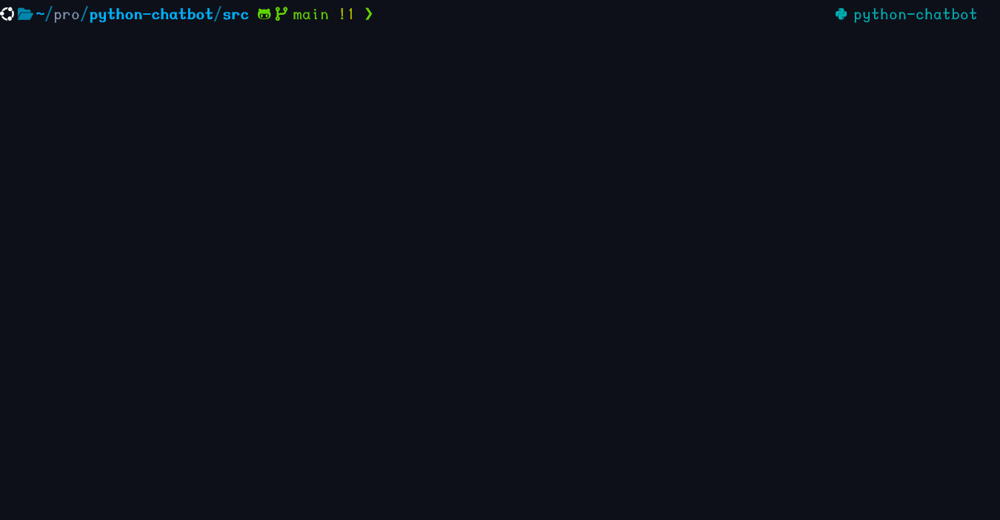

## 🤖 **Gabbot** — Chatbot Personalizable con Python + ChatterBot

¡Bienvenido a **Gabbot**! 🎉  
Un chatbot creado en **Python** con la librería [ChatterBot](https://github.com/gunthercox/ChatterBot), que aprende a conversar a partir de datasets personalizados 🧠.  
Este proyecto busca demostrar cómo entrenar y adaptar un modelo conversacional clásico según distintos contextos o estilos de conversación.

### 🎬 **Demo**



---

### 🚀 **Características principales**

- 💬 Basado en **ChatterBot**, una librería de Python para construir chatbots conversacionales.
- 📚 Entrenamiento flexible con datasets externos, como *PersonaChat*.
- 🧩 Estructura modular y fácil de extender (`bot.py`, `prepare_csv.py`, etc.).
- 💾 Persistencia en base de datos local (`db.sqlite3`).
- 🔁 Chat interactivo desde la terminal.

---

### 📁 **Estructura del proyecto**

```bash
❯ tree -L 2
.
├── README.md
├── requirements.txt
├── src
│   ├── __pycache__
│   ├── bot.py
│   ├── db.sqlite3
│   ├── personality.csv
│   └── prepare_csv.py
└── venv
    ├── bin
    ├── include
    ├── lib
    ├── lib64 -> lib
    └── pyvenv.cfg
```

El archivo principal es `src/bot.py`, que ejecuta y entrena el chatbot.
El dataset (`personality.csv`) se coloca dentro de la carpeta `src/.`

---

### 📦 **Dataset de entrenamiento**

Este proyecto utiliza el dataset **PersonaChat**, disponible públicamente en Kaggle:

👉 **Descárgalo desde aquí:**  
[https://www.kaggle.com/datasets/atharvjairath/personachat/data](https://www.kaggle.com/datasets/atharvjairath/personachat/data)

🔑 Solo necesitas una cuenta gratuita en Kaggle para descargarlo.

Una vez descargado, coloca el archivo **`personality.csv`** en:

```bash
src/personality.csv
```

---

### ⚙️ **Instalación**

1. **Clona este repositorio**:
    ```bash
    git clone https://github.com/tu-usuario/chatpot.git
    cd chatpot
    ```

2. **Crea y activa un entorno virtual**:
    ```bash
    python -m venv venv
    source venv/bin/activate    # Linux / macOS
    venv\Scripts\activate       # Windows
    ```

3. **Instala las dependencias necesarias**:
    ```bash
    pip install -r requirements.txt
    ```

---

### 🧠 **Entrenamiento y uso**

1. **Ejecuta el bot desde la carpeta `src`**:
    ```bash
    cd src
    python bot.py
    ```

2. **Durante el primer arranque, el bot**:
    - Limpia y organiza los datos del dataset con `prepare_csv.py`.
    - Entrena el modelo con ListTrainer.
    - Guarda el conocimiento en `db.sqlite3`.
    - 💡 Si deseas empezar desde cero (borrar todo el conocimiento previo):
        ```bash
        rm src/db.sqlite3
        ```

    - y vuelve a ejecutar:
        ```bash
        python src/bot.py
        ```

---

### 💬 **Ejemplo de uso**
```bash
$ python src/bot.py
> hi
🤖 Hello there! How are you today?
> I'm doing great, thanks!
🤖 That's awesome. What are you up to today?
> :q
```

Para salir, puedes escribir cualquiera de estos comandos:
```bash
:q, exit, quit
```

---

### 🧩 **Archivos clave**

| Archivo | Descripción |
|----------|-------------|
| `bot.py` | Script principal del chatbot: crea, entrena e inicia la conversación. |
| `prepare_csv.py` | Limpia y formatea el dataset CSV antes del entrenamiento. |
| `db.sqlite3` | Base de datos local con el conocimiento entrenado del bot. |
| `requirements.txt` | Lista de dependencias necesarias. |
| `personality.csv` | Dataset descargado desde Kaggle. |

---

### ⚗️ **Sobre el entrenamiento**

🧠 **ChatterBot** construye una red de relaciones entre frases.  
Mientras más consistente y extensa sea tu data, más coherentes serán las respuestas.

> ⚠️ Este modelo requiere **bastante entrenamiento** para alcanzar coherencia conversacional.
>  
> Puedes adaptar el dataset o crear el tuyo propio para darle una personalidad específica al bot.

Ejemplos de usos:
- 🤖 Chatbot con personalidad definida (divertido, formal, empático, etc.)
- 💼 Asistente temático (soporte técnico, educación, entretenimiento)
- 🧠 Proyecto educativo para practicar procesamiento de lenguaje natural (NLP)

---

### 🧭 **Próximas mejoras**

- [ ] Interfaz web con Flask o FastAPI  
- [ ] Evaluación automática de coherencia  
- [ ] Integración con modelos modernos (Transformers / OpenAI API)  
- [ ] Importador automático de chats de WhatsApp  

---

### ❤️ **Contribuciones**

¡Toda contribución es bienvenida!  
Si tienes ideas para mejorar la limpieza de datos, entrenamiento o respuestas, abre una **issue** o un **pull request**.

---

### 🧑‍💻 **Autor**

**Gabriel Guerra**  
Desarrollador Python apasionado por el aprendizaje automático, web scraping y proyectos de práctica.

---

### 🏁 **Nota final**

Este proyecto tiene fines **educativos y experimentales**.  
Su objetivo es entender cómo los chatbots clásicos aprenden mediante datasets estructurados y cómo el contexto de entrenamiento define su comportamiento final.  
Ideal para practicar **procesamiento de texto**, **lógica conversacional** y **entrenamiento incremental** en Python. 🚀
